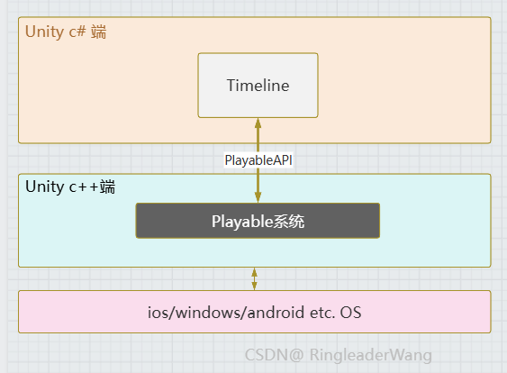

> 注：软件版本Unity 6.0 + Timeline 1.8.7
> 作者：CSDN @ RingleaderWang

# 综述

Unity的Timeline本质是一个包含很多可播放片段（Playable Clip）的区间树（IntervalTree），这个区间树可以排序、搜索、以及控制所有 Clip的激活与停止，最后利用底层的Playable系统，运行所激活的Clips，就是这么个东西。

Timeline的两个主要作用：
- 充当==技能编辑器==（策划程序向）
- 做cg动画/过场动画/==动画演出==（导演动画向）

Timeline整体结构如下：



包括底层的Playable系统，其在c++端，封闭黑盒，暴露部分API给c#端使用，Timeline就是利用这些API实现的功能。

详细来看，Timeline侧主要由PlayableAsset、PlayableBinding、TrackAsset、PlayableDirector等组成；

Playable系统侧主要是Playable、PlayableOutput、PlayableGraph三部分组成。


因为后面会频繁出现包含"Playable"的单词，所以需要辨析强调下
- Playable系统：指底层c++端关于Playable的所有功能，包含playable/playableout节点创建与连接、playableGraph的构建运行销毁等。
- PlayableAPI：指底层Playable系统暴露给c#端的接口方法。
- PlayableGraph：控制Playable/PlayableOutput的创建、连接与运行
- Playable节点：playableGraph中的数据生产与传递节点，包含叶子节点、mixer节点、layer节点等，可以进行数据处理与传递、权重混合等操作
- PlayableOutput：playableGraph中的数据输出节点，将Playable节点传递的数据交由对应的target运行
- **Playable**：不同语境含义不同，在PlayableGraph中指playable节点，讲源码时指playable节点对应的Playable这个类/结构体，timeline语境中一般指asset创建的对应playable类/结构体，放到整个unity一般指Playable API或Playable系统
- **Timeline**：
	- Timeline窗口：编排可播放片段的窗口。
	- Timeline文件：Timeline窗口编辑后生成的文件，扩展名为”.playable“。
	- TimelineAsset：指Timeline这个文件资产，或者实例化后对应的类。
	- TimelinePlayable：由TimelineAsset类在运行时调用create方法生成对应的TimelinePlayable，构建playable节点树，并管理所有轨道中的clip。

- Playable Clip：可播放片段，比如AnimationClip、AudioClip、Prefab等
- PlayableAsset：跟Playable有关的静态资产文件或其实例化的类，运行时可以创建对应的Playable。包含TimelineAsset、TrackAsset、PlayableClipAsset等。
- TrackAsset：特殊的PlayableAsset，Timeline窗口中一般直接称作track轨道，每个轨道可以放很多clip，这些clip就是PlayableClipAsset，运行时TrackAsset一般会创建MixerPlayable来混合PlayableClipAsset创建的Playable。
- PlayableBinding：绑定track和最终运行数据的target，用于创建PlayableOutput
- PlayableDirector：控制PlayableAsset，用于创建PlayableGraph来运行构建的timeline

Timeline主要有三块要点：
- Timeline静态与运行态，涉及：
	- TimelineAsset CreatePlayable 方法
	- TimelinePlayable Create方法、Compile方法、PrepareFrame方法
	- TrackAsset CreatePlayableGraph方法、CompileClips方法
- IntervalTree与RuntimeClip内部结构，涉及：
	- TrackAsset CompileClips方法
	- IntervalTree Rebuild方法
- ScriptPlayable生命周期，涉及IPlayableBehaviour接口

重点结构如下图所示：


Timeline的完整流程：


接下来会详细分析整个系统。
# Timeline 操作简介

1. 打开timeline窗口：Window>Sequencing>Timeline
    
2. 创建Timeline：直接选择gameobject 点击Timeline窗口的Create创建，或者Project窗口右键Create>Timeline进行创建。（timeline文件扩展名为 playable，是静态资产）
   
3. Timeline窗口create timeline，对象会自动创建PlayableDirector组件并绑定timeline。手动新建的话可以直接拖动timeline资产到对象，也能自动生成PlayableDirector组件。   
   
4. `PlayableDirector`用于为timeline创建对应的playable graph，可以激活`play On Awake`，那样组件awake后就能play（注意PlayableDirector组件awake远早于用户脚本awake，无法在用户脚本awake方法中控制PlayableDirector的`play on awake`参数）
	- `Bindings`会显示特定轨道所绑定的对象，用于指明当前Track控制的对象。
	- `Wrap Mode`指明Timeline播放完毕后的行为，none会直接stop timeline所在的graph（就是直接停止timeline），hold的话就是持续播放timeline最后一帧，Loop的话会从头循环播放。
	- `Update Method` 指明Timeline play如何控制，GameTime是跟随系统自动play，Unscaled Game Time就是无视系统时间倍速的自动play（游戏pause也会播放timeline），Manual就是由用户手动evaluate进行timeline play。DSP似乎跟音频有关，但官方说跟Unscaled Game Time差不多，暂不研究。

5. Timeline窗口右键添加轨道。
	主要有如下几个轨道：
	- `Activation Track`：控制激活的轨道
	- `Animation Track`：控制动画播放的轨道
	- `Audio Track`：控制音频播放的轨道
	- `Control Track`：控制prefab、粒子系统或者子timeline显示或播放的轨道
	- `Signal Track`：控制帧事件的轨道
	- `Custom Track`，就是用户自己继承`TrackAsset`、`PlayableAsset`、`PlayableBehaviour`等来实现自定义playable。
	
	
6. 创建好track和playable后就可以用PlayableDirector自动播放或手动Play()播放。

这里只是简单介绍下Timeline的用法，还有很多细节可以自己摸索或者去官方文档查看。

下面将进入本文的主题，深入讲解==Timeline的结构==，同时会浅析所涉及的==Timeline和Playable源码==。

# Timeline 静态结构分析

整体上Timeline和Animator都依赖底层的Playable系统，Playable系统利用PlayableGraph控制Playable节点的创建、连接、运行与销毁。
## Timeline编辑态结构

在Timeline窗口创建两个Track（Activation Track、Audio Track），并分别添加对应的clip。如下。

前面提到这个timeline文件扩展名为 playable，是个静态资产。
会在运行时解析成对应的PlayableAsset类，TimelineAsset、TrackAsset都是PlayableAsset。
每个PlayableAsset都包含一个createPlayable方法，用于运行时创建对应的Playable。


理解运行时Timeline首先要搞明白 静态Timeline的结构，并理清各PlayableAsset类的关系，以及clip和track、playTarget与track的关系（即Binding）。

下面分别介绍。
## PlayableAsset 静态资产

对应的Timeline.playable yaml文件如下图所示：


运行时，会根据这个yaml文件解析成 PlayableAsset节点链（利用PlayableAsset的parent、 children参数），根节点（Root PlayableAsset）是TimelinePlayableAsset，下一层是Root Track，对于Group track或者AnimationTrack允许其下还有SubTrack，每个Track都可以包含数个Clip PlayableAsset。（`注：解析过程在底层黑盒，我根据源码理解进行合理推测得出`）

- `TrackAsset parent`：如果是subTrack，parent就是其父级Track（Group track或者被override 的track）；rootTrack的parent就是TimelineAsset。
- `root track` 就是TimelinePlayableAsset的直接子track，从timeline窗口看就是最外层track。
- `output track` 会生成PlayableOutput的track。除 GroupTrack、subGroupTrack、override track外的所有track 都是 output track。


<center><font size=2 >红框为root track，黄框为output track</font></center>

## PlayableDirector

查看Timeline窗口的timeline资产有两种方式，产生的效果不同：
- 第一种是从Project窗口打开的独立timeline资产，它无法预览播放，track左侧也没有绑定对象；
- 另一种就是从挂载PlayableDirector组件对象点开，那么它的timeline就是可预览播放的，track左侧也会显示Bindings。

第二种其实就是PlayableDirector组件做的绑定。

- PlayableDirector利用key-value 来实现绑定。
- key就是Track对象（在PlayableBinding中被称作sourceObject）.
- value 就是目标对象（在PlayableOutput中被称作target），如ActivationTrack对应的就是待控制的预制体，AudioSourceTrack对应的就是Audio Source ，AnimationTrack 对应的就是Animator。


<center><font size=2 >PlayableDirector组件中SceneBindings值</font></center>

这样，包含PlayableDirector的结构图就变成下图所示：


## PlayableAsset UML类图

TrackAsset、PlayableAsset Clip 和TimelineAsset都是继承自PlayableAsset。如下图所示。

- PlayableAsset Clip 表示实现ITimelineClipAsset接口的特殊PlayableAsset，具体类有ActivationPlayableAsset、AudioPlayableAsset、AnimationPlayableAsset、ControlPlayableAsset。这些PlayableAsset拥有一个clipCaps属性，表明这个片段在Timeline窗口拥有的能力，这些能力包含
	- Looping 循环  
	- Extrapolation 外推断
	- ClipIn 起始裁切
	- SpeedMultiplier 倍速
	- blend 混合
- PlayableAsset都包含一个CreatePlayable方法，用于运行时创建对应的Playable。
- TrackAsset 拥有CreateTrackMixer方法，运行时也是创建Playable（重写CreateTrackMixer方法的话可以创建自定义MixerPlayable），可以接收多个input输入，并可以自定义处理输入权重的逻辑。
- TrackAsset 的 CompileClips方法在运行时编译其所包含的所有clip，生成RuntimeClip并加入到TimelinePlayable的IntervalTree中，用于Timeline运行标识哪个clip被激活。

### Track 的两个Attribute
继承TrackAsset的类有GroupTrack、ActivationTrack、AudioTrack、ControlTrack、SignalTrack、AnimationTrack等，这与timeline窗口能添加的track一致。

TrackAsset有两个特性（Attribute）
``` csharp
[TrackClipType(typeof(AnimationPlayableAsset), allowAutoCreate:false)]
[TrackBindingType(typeof(Animator))]
```

TrackClipType 表明Track能添加的clip类型，也就是上面继承playable且实现ITimelineClipAsset接口的类。

TrackBindingType 表明 output Track对应的PlayableOutput 其target参数类型，与PlayableBinding的SourceBindingType一致（也即outputTargetType属性）。

## 小结

至此，Timeline静态资产部分介绍完毕了，不过在正式讲解运行态Timeline之前，必须弄清楚Playable系统结构及其生命周期，因为Timeline运行的基石就是Playable系统。

# Playable系统组成

Playable系统由PlayableGraph、Playable和PlayableOutput组成。

前面timeline在运行时形成的Graph结构如下：


## Playble UML类图

PlayableAsset创建的playable有两种，一种是不带生命周期管理的Playable，另一种是带生命周期管理的（实现IPlayableBehaviour接口）。第二种其实就是Timeline模块中基于ScriptPlayable实现的一种官方自定义playable。

### 基础Playable 的 UML 类图


注意这些Playable都是Struct，没有像class一样的继承能力，但这些子Playable都重写了隐/显式操作符，所以功能上等价于存在继承关系。比如下面AudioClipPlayable例子：

``` Csharp
public static implicit operator Playable(AudioClipPlayable playable)  
{  
  return new Playable(playable.GetHandle());  
}  
  
public static explicit operator AudioClipPlayable(Playable playable)  
{  
  return new AudioClipPlayable(playable.GetHandle());  
}

// 自动转换
AudioClipPlayable audioClipPlayable = ...;
Playable playable = audioClipPlayable;

// 需要显式转换
Playable playable = ...;
AudioClipPlayable audioClipPlayable = (AudioClipPlayable)playable;
```

- 这些Playable都拥有Create方法，供TrackAsset执行CompileClips方法或CompileTrackPlayable方法期间调用。
- Playable按功能大概分成两类：
	- 一类如上面蓝色（AnimationClipPlayable等）和绿色（ScriptPlayable）的Playable，在graph中常作为叶子节点的，其内部是含有类似clip的属性，能getClip、setClip（有的没暴露set，只能在create时传入）。
	- 一类是上面黄底色的Playable，在graph中作为中间节点，可能包含多个输入，所以命名一般叫MixerPlayable、LayerPlayable，对多个输入的权重或其他数据进行处理。
- 上面结构图并没有列出所有Playable，详细的可以查看IPlayable的所有实现。
- ScriptPlayable比较特殊，能够接收`PlayableBehaviour`来控制Playable的生命周期，这样形成的就是自定义Playable（Timeline里的很多Playable本质上就是这种官方自定义Playable）。

下面就详细介绍这些所谓的“**官方自定义Playable**”。
### PlayableBehaviour 的 UML 类图


继承`PlayableBehaviour`的类分为几种：
- `TimelinePlayable`：作为graph中所有其他playable的根父节点，控制所有clip的激活与否。
- Audio的两个名字比较特别，叫`AudioMixerProperties`和`AudioClipProperties`，`AudioClipProperties`甚至连一个回调都没有，这就涉及到`PlayableBehaviour`的第二种作用：==传递PlayableAsset/TrackAsset参数给运行时的各生命周期==。这种参数传递有两种用法，后面会介绍。
- Activation有关的`ActivationControlPlayable`和`ActivationMixerPlayable`。
  比较好玩的是`ActivationControlPlayable`只用在`ControlTrack`，而`ActivationMixerPlayable`只用在`ActivationTrack`。
- `ControlTrack`的三个playable：
	- 控制粒子的`ParticleControlPlayable`
	- 控制prefab的`PrefabControlPlayable`
	- 控制PlayableDirector（也就是控制子Timeline）的`DirectorControlPlayable`。
### ⭐Behaviour 与 PlayableAsset的数据交互

我们在自定义Track 自定义PlayableAsset时，可能有这么个需求，Track或PlayableAsset自身需要拥有特殊属性，而且能在后面的生命周期中获取这个特殊属性。

比如我的技能系统用的SkillPlayableAsset，有个参数标注这个clip用于技能的哪个阶段，就需要SkiIlPhase这么一个参数，后面behaviour回调触发时就能根据这个参数针对性做处理。


这就是behaviour 与 playableAsset的数据交互问题。

如果你是官方设定的基础Playable，你可以在Playable上设置这么个特殊属性，create的时候都塞进去，生命周期回调时也能正常获取。但你自定义track，用的都是ScriptPlayable，没有额外参数，怎么办？那就是用PlayableBehaviour传参！

传参有两种方式，这同时也涉及到ScriptPlayable createPlayable的两种方式。

``` csharp
// T : class, IPlayableBehaviour, new()
public static ScriptPlayable<T> Create(PlayableGraph graph, int inputCount = 0)  
{  
  return new ScriptPlayable<T>(ScriptPlayable<T>.CreateHandle(graph, default (T), inputCount));  
}  
  
public static ScriptPlayable<T> Create(PlayableGraph graph, T template, int inputCount = 0)  
{  
  return new ScriptPlayable<T>(ScriptPlayable<T>.CreateHandle(graph, template, inputCount));  
}
```

#### 带 new T() 的 ScriptPlayable 创建
如上ScriptPlayable 创建Playable时，可以带T template 参数，T就是实现了IPlayableBehaviour且有无参构造函数的类。

这样自定track或playableAsset在创建playable时就可以将含有特殊属性的T传进来，behaviour回调时就能获取到你设的特殊属性。

``` csharp
// 存在 XXPlayableBehaviour，内涵param1、param2两个参数

public class XXPlayableAsset : PlayableAsset
{
	public XXPlayableBehaviour template = new XXPlayableBehaviour();
	public override Playable CreatePlayable (PlayableGraph graph, GameObject owner){
	   var playable = ScriptPlayable<XXPlayableBehaviour>.Create(graph,template);
	   return playable;
	}
}
```

这样你在XXPlayableAsset Inspector就能展示XXPlayableBehaviour的两个参数，param1和param2，但不够好看，外面会套一层参数名。


解决方法有两个，一种是类似AudioTrack的处理方法，写个AudioTrackInspector手动提取出各个参数。另一个参考官方案例的自定义Attribute：NoFoldOut。

``` csharp
// Custom property drawer that draws all child properties inline
[CustomPropertyDrawer(typeof(NoFoldOutAttribute))]
public class NoFoldOutPropertyDrawer : PropertyDrawer
{
    public override float GetPropertyHeight(SerializedProperty property, GUIContent label)
    {
        if (!property.hasChildren)
            return base.GetPropertyHeight(property, label);
        property.isExpanded = true;
        return EditorGUI.GetPropertyHeight(property, label, true) -
               EditorGUI.GetPropertyHeight(property, label, false);
    }

    public override void OnGUI(Rect position, SerializedProperty property, GUIContent label)
    {
        if (!property.hasChildren)
            EditorGUI.PropertyField(position, property, label);
        else
        {
            SerializedProperty iter = property.Copy();
            var nextSibling = property.Copy();
            nextSibling.Next(false);
            property.Next(true);
            do
            {
                // We need to check against nextSibling to properly stop
                // otherwise we will draw properties that are not child of this
                // foldout.
                if (SerializedProperty.EqualContents(property, nextSibling))
                    break;
                float height = EditorGUI.GetPropertyHeight(property, property.hasVisibleChildren);
                position.height = height;
                EditorGUI.PropertyField(position, property, property.hasVisibleChildren);
                position.y = position.y + height;
            }
            while (property.NextVisible(false));
        }
    }
}
```

这样使用时给参数加`[NoFoldOut]`特性就能直接展示子属性了。
``` csharp
// 存在 XXPlayableBehaviour，内涵param1、param2两个参数
public class XXPlayableAsset : PlayableAsset
{
	[NoFoldOut]
	public XXPlayableBehaviour template = new XXPlayableBehaviour();
	public override Playable CreatePlayable (PlayableGraph graph, GameObject owner){
	   var playable = ScriptPlayable<XXPlayableBehaviour>.Create(graph,template);
	   return playable;
	}
}
```

#### 使用 default (T) 的 ScriptPlayable 创建

如果你使用 default (T) 创建，意味着你的这些特殊属性都变成默认值。

不过你也可以手动操作改变，如下代码所示，create完ScriptPlayable后，再手动赋值。

``` csharp
// 存在 XXPlayableBehaviour，内涵param1、param2两个参数

public class XXPlayableAsset : PlayableAsset
{
	public override Playable CreatePlayable (PlayableGraph graph, GameObject owner)
	{
	   var playable = ScriptPlayable<XXPlayableBehaviour>.Create(graph);
	   var xxPlayableBehaviour = playable.GetBehaviour();
	   xxPlayableBehaviour.param1 = value1;
	   xxPlayableBehaviour.param2 = value2;
	   return playable;
	}
}
```

不过这种在Asset还要再申明一遍param，冗杂，推荐用第一种。

#### ExposedReference用法

因为Asset不能引用scene场景中的对象，但如果你非要引用也不是不可以，Timeline提供了ExposedReference方法让你能在Behaviour回调中获取场景中的对象。
``` csharp
public class XXPlayableBehaviour : PlayableBehaviour
{
	public ExposedReference<Transform> exposedTransform;
	public override void OnGraphStart(Playable playable){
		Transform transform = exposedTransform.Resolve(playable.GetGraph().GetResolver());  
Debug.Log("exposedTransform.Resolve(playable.GetGraph().GetResolver()):"+transform.position);
Debug.Log("gameobject name:" + transform.gameObject.name);
	
	}
}

public class XXPlayableAsset : PlayableAsset
{
	public XXPlayableBehaviour template = new XXPlayableBehaviour();
	public override Playable CreatePlayable (PlayableGraph graph, GameObject owner){
	   var playable = ScriptPlayable<XXPlayableBehaviour>.Create(graph,template);
	   return playable;
	}
}
```

注意使用时，一定要从点击挂载PlayableDirector的对象对应的timeline窗口操作。

运行时可以正常打印，但发现打印的对象position数据有问题，似乎有(0.22, 1.28, -1.66)的偏差，不清楚原因，暂时还是不要用`ExposedReference`。


### 小结

至此 Timeline使用的各个基础Playable、自定义Playable以及ScriptPlayable的两种create方式我们已经了然于胸了。

但Playable本身到底是个什么东西，我们还一无所知。

接下来我们便着手探索Playable的底层结构。

## Playable结构

Playable是一个多输入多输出的有向节点，拥有speed、time、duration、isDone、PlayState等参数标识自身的运行状态，并对外提供控制自身运行、暂停与销毁的接口。


### 节点属性/方法
Playable本身的数据结构就是有向图中的一个多输入多输出节点。
- Playable节点拥有多个input port，多个output port用于连接其他Playable节点。
-  节点连接前需保证port存在，否则报错`Connecting invalid input/output`，需要用`SetInputCount()`申请端口，或者create时指明inputCount参数。
- 同一port不能连接多个节点，否则报错`Cannot connect input/output port, it is already connected, the tree topology will be invalid. Disconnect it first`
- Input有权重weight的概念，默认是1，可以在connect时指定weight或者用`Playable.SetInputWeight(inputIndex, weight)`设定输入权重
- Playable节点间连接，可以使用`PlayableGraph.Connect(...)`或者扩展方法的`Playable.ConnectInput(...)`（默认权重为0）

``` Csharp
PlayableGraph.Connect(...)

bool Connect<U, V>(  
  U source,  
  int sourceOutputPort,  
  V destination,  
  int destinationInputPort)  
  where U : struct, IPlayable  
  where V : struct, IPlayable
```


允许的结构


不允许的结构（三个节点首尾相接）（出现死循环，如果使用graph visulizer，unity会奔溃）


### 一些特殊的属性/方法
- GetScriptInstance()，指明playable生命周期的回调方法
- GetClip()/SetClip，一些包含Clip内容的Playable如 AnimationClipPlayable、AudioClipPlayable、AnimatorControllerPlayable、MaterialEffectPlayable、CameraPlayable、VideoPlayable 拥有存取此Playable绑定的可播放片段的方法。这些方法名不固定，根据Playable类型，也可以叫 Get/SetMaterial()、GetAnimatorController、Get/SetCamera()、GetAnimationClip()等。

### 运行属性/方法
- Play state：Puase/Playing，标识此节点运行状态
- Speed：playable的播放速度
- Play()：运行playable
- Pause()：停止自身playable运行
- IsDone：标识此节点运行完毕
- Destroy()：利用所属graph销毁自身Playable
- TraversalMode：Mix/Passthrough，表示遍历节点input的方式，Mix就是将各输入进行加权；passthrough就是匹配input与output，第几个output来请求数据，就从第几个input获取数据。Passthrough目前只用于TimelinePlayable，使之成为graph的统一入口。
### ⭐Traversal mode 验证

``` csharp
[Tooltip("false则mode是passthrough，true则mode是mix")]  
public bool changeTraversalMode = false;  
[Tooltip("false则PlayableOutput的source为playable1，true则为playable2")]  
public bool changeSourcePlayable = false;

//newInput system绑定空格键触发
public void BackspaceDown(InputAction.CallbackContext ctx)  
{  
    if (ctx.performed)  
    {   
        ValidateTraversalMode2(changeTraversalMode,changeSourcePlayable);  
    }
}

private void ValidateTraversalMode2(bool _changeTraversalMode,bool _changeSourcePlayable)  
{  
    DestoryGraph(graph);  
    graph = PlayableGraph.Create();  
    var playable1 = Playable.Create(graph,1);  
    var playable2 = Playable.Create(graph,2);  
    var playable3 = Playable.Create(graph);  
    playable3.SetTraversalMode(!_changeTraversalMode?PlayableTraversalMode.Passthrough:PlayableTraversalMode.Mix);  
    var playable4 = Playable.Create(graph,4);  
    var playable5 = Playable.Create(graph,5);  
	playable3.SetInputCount(10);  
    playable3.SetOutputCount(10);  
    graph.Connect(playable3, 0, playable1, 0);  
    graph.Connect(playable3, 1, playable2, 0);  
    graph.Connect(playable4, 0, playable3, 0);  
    graph.Connect(playable5, 0, playable3, 1);  
    ScriptPlayableOutput output = ScriptPlayableOutput.Create(graph, "customOutput");  
    output.SetSourcePlayable(!_changeSourcePlayable?playable1:playable2,100);
    graph.Play();  
}
```


当Playable作为根节点连接PlayableOutput时，需要注意，按照Passthrough源码注释的本意：

应该是sourceOutputPort的PlayableOutput跟对应input位置的节点进行直通，但实测sourceOutputPort没起作用，实际上是由PlayableOutput在graph中的顺序决定，也就是下图中PlayableOutput前面的#0 #1 #2 标号（其实就是PlayableOutput数组的index）。


``` csharp
void ValidateTraversalMode()  
{  
    DestoryGraph(graph);  
    graph = PlayableGraph.Create("TraversalModeGraph");  
    ScriptPlayableOutput output = ScriptPlayableOutput.Create(graph, "customOutput");  
    ScriptPlayableOutput output2 = ScriptPlayableOutput.Create(graph, "customOutput2");  
    ScriptPlayableOutput output3 = ScriptPlayableOutput.Create(graph, "customOutput3");  
    var playable = ScriptPlayable<CustomClipBehaviour>.Create(graph);  
    var playable2 = ScriptPlayable<CustomClipBehaviour>.Create(graph);  
    var playable3 = ScriptPlayable<CustomClipBehaviour>.Create(graph);  
    var playable4 = ScriptPlayable<CustomClipBehaviour>.Create(graph);  
    var playable5 = ScriptPlayable<CustomClipBehaviour>.Create(graph);  
    var mixer = ScriptPlayable<CustomMixerBehaviour>.Create(graph);  
    mixer.SetTraversalMode(PlayableTraversalMode.Passthrough);//默认mode为mix，这里改为passthrough  
    mixer.SetInputCount(10);// 很重要，否则连接报错：Connecting invalid input  
    mixer.ConnectInput(4,playable,0,1);  
    mixer.ConnectInput(6,playable2,0,1);  
    mixer.ConnectInput(2,playable3,0,1);  
    mixer.ConnectInput(8,playable4,0,1);  
    mixer.ConnectInput(1,playable5,0,1);  
    output.SetSourcePlayable(mixer,30);// 这个SetSourcePlayable的port根本没用，完全根据PlayableOutput顺序获取的  
    output2.SetSourcePlayable(mixer,50);  
    output3.SetSourcePlayable(mixer,100);  
    graph.Play();  
}
```

其实从Animation计算权重的过程也能看出，SourceOutputPort本意就是playable的output port。但实测中Playableout获取数据时并没有使用这个参数，更没有校验，你设多少都可以（只校验了不能重复绑定，但没校验port是否存在）。

如果是bug的话，官方可能需要做下面两个步骤进行修复：
- 每connect一个节点到TimelinePlayable，TimelinePlayable的outputCount加一（这样直通才有意义）
- 对每个Playableout从根节点TimelinePlayable开始遍历时，严格按照`TimelinePlayable.getInput(PlayableOutput.GetSourceOutputport())`获取绑定的Playable，而不是用`PlaybleGraph`中类似`PlayableOytput[]`数组的`index`来get input playable。（注：Timeline生成的graph中`PlayableOutput.GetSourcePlayable()`得到的就是`TimelinePlayable`）

## PlayableOutput 类和结构

### UML 类图
相比Playable的类图，PlayableOutput就显得眉清目秀了。
- 跟Playable一样，PlayableOutput也是struct结构体，它的继承也是重载操作符的形式。
- 每种PlayableOutput都有个create方法来创建一个具体的PlayableOutput。
- 除了ScriptPlayableOutput外，都有个target参数用于指明track binding的target对象。


### PlayableOutput 结构
PlayableOutput 的结构也相当简单。

- ReferenceObject：对应的TrackAsset
- SourcePlayable：PlayableOutput连接的Playable，使用扩展方法`PlayableOutput.SetSourcePlayable(Playable value, int port)`连接
- 注意连接的SourcePlayable和port不能都一样，否则报错`Cannot set multiple PlayableOutputs to the same source playable and output port`
- weight：PlayableOutput也拥有权重，一般为1，在Timeline有过渡需求时可能用到。
- target：AnimationPlayableOutput、AudioPlayableOutput、TexturePlayableOutput拥有这个属性，表示Track所绑定的对象，用于后续执行内含的clip。

## PlayableGraph类和结构

PlayableGraph管理Playable和PlayableOutput节点，控制整个节点树的运行。

一个常见的创建graph案例（注意一定要及时销毁graph）：
``` csharp
public AnimationClip clip;  
public AnimationClip clip2;  
private PlayableGraph graph;

void DestoryGraph(PlayableGraph graph)  
{  
    if (graph.IsValid())  
    {        
	    graph.Destroy();  
    }
}
  private void CreateMixerGraph()
    {
        DestoryGraph(graph);
        // 1. 创建 PlayableGraph
        graph = PlayableGraph.Create("MixerPlayableGraph");
        // 2. 获取 Animator 并创建 AnimationPlayableOutput
        var animator = GetComponent<Animator>();
        var animationOutput = AnimationPlayableOutput.Create(graph, "Animation", animator);
        // 3. 创建 AnimationClipPlayable
        var clipPlayable = AnimationClipPlayable.Create(graph, clip);
        var clipPlayable2 = AnimationClipPlayable.Create(graph, clip2);
        // 4. 创建一个 Mixer，管理多个动画输入
        AnimationMixerPlayable mixer = AnimationMixerPlayable.Create(graph, 2);
        mixer.ConnectInput(0, clipPlayable, 0,1);
        mixer.ConnectInput(1, clipPlayable2, 0,1);
        // 5. 设置 mixer 作为输出
        animationOutput.SetSourcePlayable(mixer);
        // 6. 播放图谱
        graph.Play();
    }
public void OnDestroy()  
{  
    DestoryGraph(graph); 
}
```

使用[Playable Graph Monitor](https://zhuanlan.zhihu.com/p/610548592) 查看 整个graph如下。


Timeline 运行时会根据PlayableDirector的Playable参数创建PlayableGraph。PlayableGraph的很多方法都可以直接在PlayableDirector中调用。


PlayableDirector可以用`PlayableDirector.playableGraph`属性获得创建的graph；
PlayableGraph也可以用`PlayableGraph.GetResolver() as PlayableDirector` 解析出PlayableDirector。

PlayableGraph 和 PlayableDirector UML类图：


可以看到内部包含了很多 Play() Stop() ReBuildGraph()等方法，具体如何执行的就是下面运行时Timeline的内容了，涉及graph构建和运行的具体过程。
# 运行时Timeline

## Timeline运行时步骤

1. PlayableDirector组件初始化（包含PlaybleAsset实例化），如果play on awake打开，则开始构建graph，否则等待director执行Play()或RebuildGraph()才开始构建graph。此过程隐藏在Unity c++端。
2. 构建graph：
	1. 根据**PlayableDirector**的PlaybleAsset 执行创建Playable动作（其实就是TimelineAsset 开始**创建 TimelinePlayable**），这个调用也是c++端触发的
	2. 创建**TimelinePlayable**节点，设置**traversalMode**为**Passthrough**
	3. 遍历Timeline中的每个**OutputTrack**，为其创建**MixerPlayable**节点和**ClipPlayable**节点
		1. 创建MixerPlayable父节点
		2. 遍历TrackAsset的每个**TimelineClip**，创建对应的ClipPlayable子节点
		3. 利用MixerPlayable、刚创建的ClipPlayable和对应的TimelineClip创建**RuntimeClip**，然后将RuntimeClip存储到TimelinePlayable的**区间树IntervalTree**中，同时执行ClipPlayable的==Pause()==方法
		4.  连接ClipPlayable子节点和MixerPlayable父节点，==权重设置为0==
	4. 将上面创建的每个MixerPlayable连接TimelinePlayable，==权重为1==
	5. 紧接着对每个OutputTrack创建对应的playableOutput节点，并**SetSourcePlayable**为**TimelinePlayable**，权重设为1，**ReferenceObject**为这个**TrackAsset**。
		- 如果是动画track的话，最后会为PlayableOutput注册一个权重处理回调`m_EvaluateCallbacks.Add(new AnimationOutputWeightProcessor(animOutput))`，构造AnimationOutputWeightProcessor时将AnimationPlayaleOutput的==权重设为0==（默认为1）。这个Processor会在graph后续运行时触发WeightEvaluate方法处理Animation相关的权重。
		- 注意playableOutput的target不是在此时添加的，这时传入的target都是null，可以通过`((AnimationPlayableOutput)graph.GetOutput(0)).GetTarget()`验证（值一定是null，假设第一个是动画的output情况下）。
			- 真正设置target的动作可能在构建gragh动作之后，在c++端手动根据binding信息设置（可能是通过共有的ReferenceObject 这个key来确定target的）。
			- 所以play阶段target是有值的（如果编辑时你确实binding了）。
			- 那为什么不在创建时顺便设置target呢？我猜还是静态资产没办法赋scene中对象的原因。这些TrackAsset实际是没法存target对象的。
	
3. 运行graph：
	1. TimelinePlayable PrepareFrame() 处理clip的激活 与权重
		1. 遍历区间树，处理clip enable与disable（会触发对应Playable的Play()或Pause()）
		2. 根据mixin/mixout curve设置激活的clip所在的mixer input weight权重
		3. 执行AnimationOutputWeightProcessor.Evaluate()处理mixer layer和PlayaleOutput 的权重
	2. 后序遍历Playable执行playing态的Playable的ProcessFrame方法。Animation的processAnimation应该是在此后执行的。
4. 停止graph：
5. 销毁graph：


## 构建
### AnimationPlayable的权重处理

Timeline 会利用 AnimationOutputWeightProcessor Evaluate方法处理AnimationMixer 、AnimationLayer和 AnimationPlayableOutput的权重。

大概效果如下，设四个clip初始权重分别为0.26，0.14，0.19，0.13，连到各自Mixer和Layer后，如果输入权重和小于1，会按比例放大为：
- **mixer input0 weight** ：0.65= 0.26/(0.26+0.14)\*1
- **mixer input1 weight** ：0.35= 0.14/(0.26+0.14)\*1
- **layer input0 weight** ：0.56=(0.26+0.14)/(0.26+0.14+0.19+0.13)\*1
- **AnimationOutput weight** ： 0.72 = 0.26+0.14+0.19+0.13


如果输入权重和≥1，则只对≥1的输入钳值到1，不等比例缩小，且**AnimationOutput weight** 钳值为1.

比如四个clip初始权重分别为0.6，0.9，0.2，0.3，AnimationOutputWeightProcessor.Evaluate()执行完后：
- **mixer input0 weight** ：0.6 （0.6+0.9>1不缩放，且0.6<1 不钳值）
- **mixer input1 weight** ：0.9（0.6+0.9>1不缩放，且0.9<1 不钳值）
- **layer input0 weight** ：1 （0.6+0.9+0.2+0.3>1不缩放，且0.6+0.9>1 则钳值到1）
- **layer input1 weight**  ： 0.5 （0.6+0.9+0.2+0.3>1不缩放，且0.2+0.3<1 不钳值）
- **AnimationOutput weight**：1（0.6+0.9+0.2+0.3>1 钳值到1）


这么处理的目的按源码注释的说法：”对动画轨道上的权重进行后处理，以正确归一化混合器权重，从而避免混合时出现默认姿势，并确保子轨道、图层以及图层图正确混合。Does a post processing of the weights on an animation track to properly normalize the mixer weights so that blending does not bring default poses and subtracks, layers and layer graphs blend correctly ”

测试用例过长，参见：🔗TimelineTestForAnimationWeightInfo，🔗WeightControllerEditor


## 运行

运行graph：
1. 遍历区间树，处理clip激活
2. output根据target运行clip？
3. 权重何时处理的？
### TimelineClip、RuntimeClip与区间树IntervalTree

以AnimationClip为例子，说明RuntimeClip的构建和运行过程：

#### 编辑时
（主逻辑在TrackAsset）
1. 创建**TimelineClip**
	1. 根据TrackClipTypeAttribute的定义获取限定的ClipType`GetType().GetCustomAttributes(typeof(TrackClipTypeAttribute))`，
	2. 创建限定ClipType的 TimelineClip 容器`newClip = CreateNewClipContainerInternal()`
	3. 把特定类型 ClipPlayableAsset 比如AnimationPlayableAsset塞进TimelineClip中asset参数中。（此时AnimationPlayableAsset中clip为null）
2. 将具体AnimationClip塞进AnimationPlayableAsset的clip变量中`AddClipOnTrack(newClip, parentTrack, candidateTime, assignableObject, state)` 

#### 构建graph运行时
（主逻辑在TrackAsset 的 CompileClips方法）
4. 创建**RuntimeClip**
	1. 根据timelineClip和clip对应的Playable创建RuntimeClip
	2. 将新建的RuntimeClip加入区间树**IntervalTree**中
5. 重新排序区间树节点（可延迟执行）
#### Play graph运行时

（主逻辑在TimelinePlayable PrepareFrame方法）
6. 利用IntervalTree获取当前帧所有激活的RuntimeClip
7. disable上一帧激活，这一帧未激活的clip，会执行Playable的Pause()方法
8. enable这一帧激活的clip，会执行Playable的Play()方法
9. 根据mixin/mixout curve设置此clip所在的mixer input weight权重


#### IntervalTree 结构
TimelinePlayable利用IntervalTree来管理RuntimeClip。


## PlayableGraph与Timeline生命周期

### PlayableBehaviour

可以利用 ScriptPlayable 传入自定义PlayableBehaviour 来干涉Playable的生命周期。
下面的自定义PlayableBehaviour就是简单打印回调方法和playable：

``` c#
public class TimelineTestForAnimationScriptBehaviour : PlayableBehaviour
    {
        public override void OnGraphStart(Playable playable)
        {
            DebugLog(playable,"OnGraphStart");
        }

        private static void DebugLog(Playable playable, string methodName)
        {
            Debug.Log($"Playable by in/output cnt_{playable.GetInputCount()}{playable.GetOutputCount()} Behaviour:{methodName}");
        }

        public override void OnGraphStop(Playable playable)
        {
            DebugLog(playable,"OnGraphStop");
        }

        public override void OnPlayableCreate(Playable playable)
        {
            DebugLog(playable,"OnPlayableCreate");
        }

        public override void OnPlayableDestroy(Playable playable)
        {
            DebugLog(playable,"OnPlayableDestroy");
        }

        public override void OnBehaviourPlay(Playable playable, FrameData info)
        {
            DebugLog(playable,"OnBehaviourPlay");
        }

        public override void OnBehaviourPause(Playable playable, FrameData info)
        {
            DebugLog(playable,"OnBehaviourPause");
        }

        public override void PrepareFrame(Playable playable, FrameData info)
        {
            DebugLog(playable,"PrepareFrame");
        }
        
         public override void ProcessFrame(Playable playable, FrameData info, object playerData)
        {
            DebugLog(playable,"ProcessFrame");
         }
    }
```

### 生命周期验证
``` csharp
using System;
using Scenes.TimelineTest.scripts;
using UnityEditor;
using UnityEngine;
using UnityEngine.Playables;

public class TimelineTestForLifeCycle : MonoBehaviour
{
    public PlayableGraph graph;

    private ScriptPlayable<TimelineTestForAnimationScriptBehaviour> playable3;
    public void CreateGraph()
    {
        DestroyGraph();
        graph = PlayableGraph.Create("TimelineTestForLifeCycle");
        ScriptPlayableOutput output = ScriptPlayableOutput.Create(graph,"LifeCycleTestOutput");
        var playable5 = ScriptPlayable<TimelineTestForAnimationScriptBehaviour>.Create(graph,5);
        var playable4 = ScriptPlayable<TimelineTestForAnimationScriptBehaviour>.Create(graph,4);
        playable3 = ScriptPlayable<TimelineTestForAnimationScriptBehaviour>.Create(graph,3);
        var playable2 = ScriptPlayable<TimelineTestForAnimationScriptBehaviour>.Create(graph,2);
        var playable1 = ScriptPlayable<TimelineTestForAnimationScriptBehaviour>.Create(graph,1);
        output.SetSourcePlayable(playable5,0);
        output.SetWeight(1);//验证下默认权重多少，我猜是1
        playable5.ConnectInput(0,playable1,0,1);
        playable5.ConnectInput(1,playable2,0,0.5f);
        playable3.Pause();
        playable5.ConnectInput(2,playable3,0,1);
        playable5.ConnectInput(3,playable4,0,0);
        
        var playable9 = ScriptPlayable<TimelineTestForAnimationScriptBehaviour>.Create(graph,9);
        var playable8 = ScriptPlayable<TimelineTestForAnimationScriptBehaviour>.Create(graph,8);
        playable9.ConnectInput(0,playable8,0,1);
    }

    public void PlayPlayable3()
    {
        playable3.Play();
    }
    public void PausePlayable3()
    {
        playable3.Pause();
    }
    public void DestroyPlayable3()
    {
        playable3.Destroy();
    }

    public void PlayGraph()
    {
        graph.Play();
    }
    private void OnDestroy()
    {
        DestroyGraph();
    }

    public void DestroyGraph()
    {
        if (graph.IsValid())
        {
            Debug.Log("Execute Graph Destroy");
            graph.Destroy();
            Debug.Log("Graph destroyed");
        }
    }
}

[CustomEditor(typeof(TimelineTestForLifeCycle))]
class TimelineTestForLifeCycleEditor : Editor
{
    public override void OnInspectorGUI()
    {
        base.OnInspectorGUI();
        TimelineTestForLifeCycle script = (TimelineTestForLifeCycle) target;
        if (GUILayout.Button("CreateGraph"))
        {
            script.CreateGraph();
        }
        if (GUILayout.Button("PlayGraph"))
        {
            script.PlayGraph();
        }
        if (GUILayout.Button("Destroy graph"))
        {
            script.DestroyGraph();
        }
        if (GUILayout.Button("Play Playable3"))
        {
            script.PlayPlayable3();
        }

        if (GUILayout.Button("Pause Playable3"))
        {
            script.PausePlayable3();
        }
        if (GUILayout.Button("Destroy Playable3"))
        {
            script.DestroyPlayable3();
        }
    }
}

```


给不同节点设置不同端口数能很方便辨析是哪个节点的回调。

当前脚本主要测试graph的 create与play（除了prepareFrame、processFrame），验证：
- graph不play，playable节点是否会运行
- 没有playableOutput，playable节点是否会运行
- 输出权重为0，playable节点是否会运行
- pause状态，playable节点是否会运行
- PrepareFrame、ProcessFrame顺序
- Graph destroy执行效果


打印结果：
``` csharp
// 打印
Playable by in/output cnt_51 Behaviour:OnPlayableCreate  
Playable by in/output cnt_41 Behaviour:OnPlayableCreate  
Playable by in/output cnt_31 Behaviour:OnPlayableCreate  
Playable by in/output cnt_21 Behaviour:OnPlayableCreate  
Playable by in/output cnt_11 Behaviour:OnPlayableCreate  
Playable by in/output cnt_91 Behaviour:OnPlayableCreate  
Playable by in/output cnt_81 Behaviour:OnPlayableCreate  
Playable by in/output cnt_51 Behaviour:OnGraphStart  
Playable by in/output cnt_51 Behaviour:OnBehaviourPlay  
Playable by in/output cnt_11 Behaviour:OnGraphStart  
Playable by in/output cnt_11 Behaviour:OnBehaviourPlay  
Playable by in/output cnt_21 Behaviour:OnGraphStart  
Playable by in/output cnt_21 Behaviour:OnBehaviourPlay  
Playable by in/output cnt_31 Behaviour:OnGraphStart  
Playable by in/output cnt_31 Behaviour:OnBehaviourPause  
Playable by in/output cnt_41 Behaviour:OnGraphStart  
Playable by in/output cnt_41 Behaviour:OnBehaviourPlay  
  
Playable by in/output cnt_51 Behaviour:PrepareFrame  
Playable by in/output cnt_11 Behaviour:PrepareFrame  
Playable by in/output cnt_21 Behaviour:PrepareFrame  
Playable by in/output cnt_41 Behaviour:PrepareFrame  
Playable by in/output cnt_11 Behaviour:ProcessFrame  
Playable by in/output cnt_21 Behaviour:ProcessFrame  
Playable by in/output cnt_41 Behaviour:ProcessFrame  
Playable by in/output cnt_51 Behaviour:ProcessFrame  
  
Graph destroyed  
Playable by in/output cnt_51 Behaviour:OnBehaviourPause  
Playable by in/output cnt_11 Behaviour:OnBehaviourPause  
Playable by in/output cnt_21 Behaviour:OnBehaviourPause  
Playable by in/output cnt_41 Behaviour:OnBehaviourPause  
Playable by in/output cnt_51 Behaviour:OnGraphStop  
Playable by in/output cnt_51 Behaviour:OnPlayableDestroy  
Playable by in/output cnt_41 Behaviour:OnGraphStop  
Playable by in/output cnt_41 Behaviour:OnPlayableDestroy  
Playable by in/output cnt_31 Behaviour:OnGraphStop  
Playable by in/output cnt_31 Behaviour:OnPlayableDestroy  
Playable by in/output cnt_21 Behaviour:OnGraphStop  
Playable by in/output cnt_21 Behaviour:OnPlayableDestroy  
Playable by in/output cnt_11 Behaviour:OnGraphStop  
Playable by in/output cnt_11 Behaviour:OnPlayableDestroy  
Playable by in/output cnt_91 Behaviour:OnPlayableDestroy  
Playable by in/output cnt_81 Behaviour:OnPlayableDestroy
```

结合Graph Monitor 可以得出结论：
- graph不play，playable节点不会运行
- 没有连ScriptPlayableOutput，ScriptPlayable节点不会运行（playable time不随时间增加），且除了OnPlayableCreate和OnPlayableDestroy，其他回调方法不会触发
- 输出权重为0，playable节点依然运行
- pause状态，playable节点不会运行
- graph未play，playable执行pause并不会触发OnBehaviourPause
- graph 执行Play() 后：若playable是playing状态时，则触发OnBehaviourPlay回调；是paused状态时，则触发OnBehaviourPause回调
- 会以**前序**遍历（父节点优先）的方式触发OnGraphStart 和 OnBehaviourPlay/Pause
- 会以**前序**遍历（父节点优先）的方式触发PrepareFrame回调
- 会以**后序**遍历（子节点优先）的方式触发ProcessFrame回调
- 没有连接playableOutput的playable节点不会触发OnGraphStart/OnGraphStop回调
- 直接Destroy playable时，如果graph未stop会先触发OnBehaviourPause、OnGraphStop回调，这两个回调的触发逻辑与先Stop Graph后Destroy Graph 略有不同

``` csharp
graph.Stop()

Playable by in/output cnt_51 Behaviour:OnBehaviourPause  
Playable by in/output cnt_51 Behaviour:OnGraphStop  
Playable by in/output cnt_11 Behaviour:OnBehaviourPause  
Playable by in/output cnt_11 Behaviour:OnGraphStop  
Playable by in/output cnt_21 Behaviour:OnBehaviourPause  
Playable by in/output cnt_21 Behaviour:OnGraphStop  
Playable by in/output cnt_31 Behaviour:OnBehaviourPause  
Playable by in/output cnt_31 Behaviour:OnGraphStop  
Playable by in/output cnt_41 Behaviour:OnBehaviourPause  
Playable by in/output cnt_41 Behaviour:OnGraphStop  
   
Graph.Destroy()  
  
Playable by in/output cnt_51 Behaviour:OnPlayableDestroy  
Playable by in/output cnt_41 Behaviour:OnPlayableDestroy  
Playable by in/output cnt_31 Behaviour:OnPlayableDestroy  
Playable by in/output cnt_21 Behaviour:OnPlayableDestroy  
Playable by in/output cnt_11 Behaviour:OnPlayableDestroy  
Playable by in/output cnt_91 Behaviour:OnPlayableDestroy  
Playable by in/output cnt_81 Behaviour:OnPlayableDestroy
```

完整生命周期：


## Playable数据传递与output处理数据

ScriptPlayable数据处理在ProcessFrame中，可以实现Prefab的enable disable，video的播放暂停等功能。

而基础Playable如AnimationClipPlayable，其Animation数据处理是隐藏起来的，实际是通过AnimationStream结构体进行数据交互，你可以 使用 AnimationScriptPlayable 并实现IAnimationJob 的 ProcessAnimation方法来自定义处理动画数据。


> [Playable使用细则](https://zhuanlan.zhihu.com/p/632890306)


至于数据传入AnimatorPlayableOutput后怎么处理更是黑盒了，可以看一下下面这位博主的分析：


> [死板地介绍Unity动画系统设计](https://zhuanlan.zhihu.com/p/305825751)

Animator的高级使用估计得等到有IK或者更精细动画需求后，才可能再继续研究了。
目前在SMB+Timeline加持下已能满足大部分需求了。

# 总结

本文的Timeline和Playable系统，还是花了不少精力的：
- 详细展示了Timeline和Playable各个类的UML关系
- 系统梳理了Timeline静态和运行时结构与逻辑
- 详细分析了Playable、区间树IntervalTree等内部结构
- 验证了很多细节，比如AnimationOutput weight作用、ScriptPlayable生命周期、Passthrough TraversalMode的效果等

吃透了本文，自定义Track就是易如反掌了。

下一篇可能写点技能编辑器相关。

记得点赞、关注、收藏哦~
